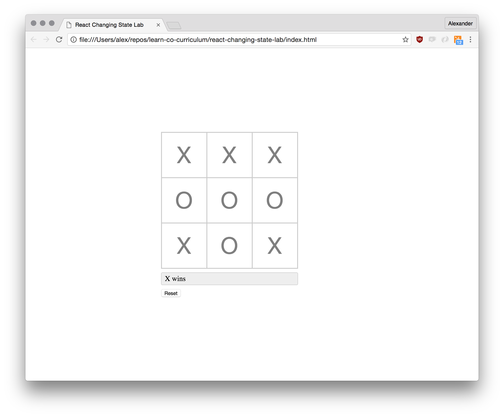

# React Changing State Lab

## Overview

In this lab, you'll implement a Tic Tac Toe game where you will respond to state changes in React amd rendering React components. 

## Tic-tac-toe

One upon a time, long before Virtual Reality, Pokemon Go and World of Warcraft, people used to play games on "physical" paper with "real" pencils. One of those games was Tic-tac-toe.

Tic-tac-toe is a really simple paper-and-pencil game for two players. Each turn, one of the players (**X** or **O**) marks a space in a 3x3 grid. The first player to place three marks in a vertical, horizontal, or diagonal row wins.

In this lab we're going to implement such a game. Our app should allow us to place **X**s and **O**s on the playing field. Once a player succeeds by placing three of their marks in a row, an alert should appear and the playing field should be reset.

This is how our final application is going to look like:

There are four different components:

### `Game.js`

The game component represents the application as a whole. It is the only statful component. The initial state of the `Game` component should encode the following information:

* `board`, e.g. `[null, 'x', null, null, null, null, null, null, null]`

  The `board` state represents the current state of the Tic Tac Toe game. Each
  item in the array stands for one field. `null` means a player can mark the
  field, `X` means the `X` player marked the field etc.

* `turn`, e.g. `X` or `O`.

  If `turn` is `X`, then it's currently `X`'s turn. If `turn` is `O`, then it's
  currently `O`'s turn.

### `Board.js`

The board component is a pure component. It consists of exactly nine `Field`s and accepts the `board` prop. It renders the actual Tic Tac Toe board.

### `Status.js`

The status component can be seen in the above screenshot as the gray box. It notifies the user about the current state of the game (Tie / X won / O won).

## Resources

- [React: Working with the Browser](https://facebook.github.io/react/docs/working-with-the-browser.html)

## Credits

- Tic Tac Toe image by [Symode09](https://commons.wikimedia.org/w/index.php?curid=2064271) — Own work, Public Domain
